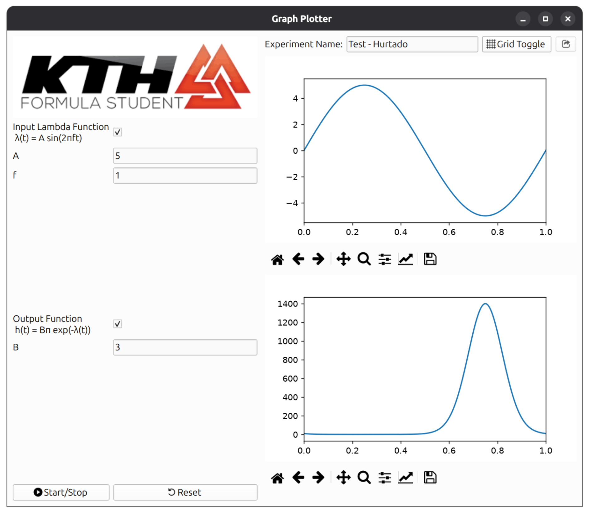

# Driverless Recruitment Exercises
## Overview
According to the instructions this repo contains the code developed during the training/exercises for the KTHFS driverless team. 

## Exercise 1
This exercise, as well as the tutorials, were developed using [pixi](https://pixi.prefix.dev/latest/) in order to configure the ros environment. The minimal `pixi.toml` file used to install the environment has been included as reference in the repo. Inside the `exc1` folder the code for `package1` and `package2` containing `nodeA.py` and `nodeB.py` can be found, as well as a png example from plotjuggler. 

## Exercise 2
A small app was created allowing to display the function h(t) in a parametric form with real time updates and live simulation. 


### Built with
* **Python** `3.14.4` 
* **PyQt6**
* **Matplotlib** 

### Usage
After cloning the repo, open the folder drhbFS-exercises in VSCode or other text editor.

Create a venv and install the `requiriments.txt` via
```
python -m venv .venv
source .venv/bin/activate
```

```
pip install -r requirements.txt
```

Run `app_plotter.py`
```
python exercise2/kthfsdev-plotting/app_plotter.py
```

## Contact

**David Hurtado Barreto**  
drhb@kth.se 

KTH Royal Institute of Technology

